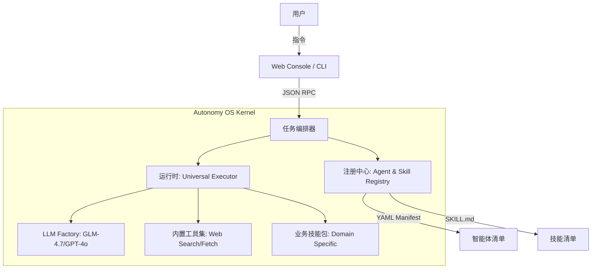

# Autonomy 技术架构白皮书 (Nexus V4 - Universal Architecture)

## 1. 核心哲学：从“应用”到“操作系统”

Autonomy 不再是一个特定的垂直领域应用，而是一个**智能体操作系统 (Agent OS)**。它通过解耦认知、能力与环境，实现了对任何商业目标的自主达成。

### 架构拓扑 (Nexus V4)

---

## 2. 关键组件深度解析

### 2.1 声明式注册中心 (Resource Registry)
系统采用 **“配置即能力”** 的模式。
*   **Agent Manifest**: 使用 YAML 定义智能体的原型（如 `primary_agent`），包含其角色偏好、授权技能集和默认模型。
*   **Skill Manifest**: 技能作为自描述单元存在，包含元数据定义、参数 Schema 和物理执行脚本路径。

### 2.2 通用执行器 (Universal Agent Runtime)
核心引擎 `AgentRuntime` 负责管理单个节点的生命周期：
1.  **Thought**: 驱动 LLM 进行意图审计与环境映射。
2.  **Plan**: 维护动态任务清单，实现过程透明。
3.  **Action**: 拦截流中的结构化标签，通过 `importlib` 动态加载并执行工具。
4.  **Observation**: 捕获执行结果，通过标准化的 SUCCESS/FAILED 状态机反馈给模型进行下一轮迭代。

### 2.3 结构化通讯协议 (Structural RPC)
废弃语义化提及，强制执行严格的 JSON 协作：
*   **`<call>`**: 用于 Agent 间的委派，支持 context 状态传递。
*   **`<action>`**: 用于动用内置工具或授权技能。

---

## 3. 安全与隔离 (Sandboxing)

*   **路径锁定**: 所有文件操作强制使用绝对路径，严禁跨越授权目录。
*   **权限最小化**: Agent 仅能感知其 Manifest 中显式声明的 Skills。
*   **SSRF 防护**: 内置工具具备基础的网络隔离能力，防止内网穿透。

---

## 4. 生产级提示词系统

系统提示词采用分层编译模式，在运行时动态合成：
1.  **Base Instruction**: 定义底层人格、安全边界与通讯协议。由 Admin 全局配置。
2.  **Role Instruction**: 注入智能体特有的身份与职责描述（Manifest）。
3.  **Dynamic Context**: 实时注入当前 Agent 拥有的技能文档与上下文快照。

---
*Last Updated: 2025-12-31*